# System Architecture: Dune Awakening Deep Desert Tracker

## 1. Overview

The Dune Awakening Deep Desert Tracker is a **production-ready** web application built with React (TypeScript) on the frontend and Supabase for backend services (Authentication, Database, Storage). The application provides comprehensive exploration tracking across multiple game regions: a grid-based map system for the Deep Desert region and an interactive coordinate-based map system for the Hagga Basin region.

**Status**: **100% COMPLETE** - All architectural components are fully implemented and operational.

## 2. Components and Layers

```mermaid
flowchart TD
    subgraph "User Interface (React + Tailwind CSS) - COMPLETE ✅"
        direction LR
        A[Auth Components] --> P[Pages]
        G[Deep Desert Grid Components] --> P
        HB[Hagga Basin Interactive Map Components] --> P
        POI_C[Unified POI Management Components] --> P
        ADM[Admin Panel Components + Settings] --> P
        COL[POI Collections & Sharing] --> P
        SETTINGS[Map Settings Management] --> P
    end

    subgraph "Frontend Logic (TypeScript) - COMPLETE ✅"
        direction LR
        R[React Router v6] --> S[State Management]
        S[State Management React Context/Hooks]
        U[Utility Functions src/lib]
        T[Type Definitions src/types]
        COORD[Coordinate Conversion Utils]
        ZOOM[Zoom/Pan Logic react-zoom-pan-pinch]
        ADMIN_LOGIC[Admin Settings State Management]
    end

    subgraph "Backend Services (Supabase) - COMPLETE ✅"
        direction LR
        SB_Auth["Supabase Auth"] --> DB["Database Schema"]
        SB_DB["Supabase Database PostgreSQL"] --> DB
        SB_Store["Supabase Storage"] --> DB
        EF["Edge Functions"]
        PG_CRON["pg_cron Scheduling"]
        PG_NET["pg_net HTTP Extensions"]
    end

    subgraph "Database Schema (Complete Extended) - 100% ✅"
        direction TB
        POIS["pois (unified with map_type)"]
        GRID["grid_squares (Deep Desert)"]
        TYPES["poi_types (shared)"]
        PROFILES["profiles"]
        BASE_MAPS["hagga_basin_base_maps"]
        OVERLAYS["hagga_basin_overlays"]
        COLLECTIONS["poi_collections"]
        SHARES["poi_shares"]
        CUSTOM_ICONS["custom_icons"]
        APP_SETTINGS["app_settings (admin config)"]
        COMMENTS["comments (threading system)"]
        LIKES["comment_likes (reactions)"]
    end

    subgraph "Storage Structure - COMPLETE ✅"
        direction TB
        SCREENSHOTS["screenshots/ (existing)"]
        ICONS["screenshots/icons/ (POI types)"]
        HB_BASE["screenshots/hagga-basin/base-maps/"]
        HB_OVERLAYS["screenshots/hagga-basin/overlays/"]
        CUSTOM["screenshots/custom-icons/[user-id]/"]
    end

    subgraph "Scheduled Tasks Flow - OPERATIONAL ✅"
        ADMIN["AdminPanel"] --> SCHEDULE["schedule-admin-task"]
        SCHEDULE --> PG_FUNC["convert_to_utc_components"]
        PG_FUNC --> CRON["pg_cron"]
        CRON --> BACKUP["perform_map_backup"]
        CRON --> RESET["perform_map_reset"]
    end

    subgraph "Admin Settings Flow - NEW & COMPLETE ✅"
        ADMIN --> SETTINGS_UI["Map Settings UI"]
        SETTINGS_UI --> SETTINGS_STATE["Settings State Management"]
        SETTINGS_STATE --> APP_SETTINGS
        APP_SETTINGS --> SETTINGS_LOAD["Load on Mount"]
        SETTINGS_LOAD --> SETTINGS_UI
    end

    P --> S
    S --> SB_Auth
    S --> SB_DB
    S --> SB_Store
    S --> EF
    U --> S
    T --> P
    T --> S
    COORD --> HB
    ZOOM --> HB
    ADMIN_LOGIC --> SETTINGS

    DB --> POIS
    DB --> GRID
    DB --> TYPES
    DB --> PROFILES
    DB --> BASE_MAPS
    DB --> OVERLAYS
    DB --> COLLECTIONS
    DB --> SHARES
    DB --> CUSTOM_ICONS
    DB --> APP_SETTINGS
    DB --> COMMENTS
    DB --> LIKES

    SB_Store --> SCREENSHOTS
    SB_Store --> ICONS
    SB_Store --> HB_BASE
    SB_Store --> HB_OVERLAYS
    SB_Store --> CUSTOM

    EF --> PG_CRON
    PG_CRON --> PG_NET

    classDef supabase fill:#3ecf8e,stroke:#333,stroke-width:2px,color:#fff;
    class SB_Auth,SB_DB,SB_Store,EF,DB,SCHEDULE,PG_FUNC,CRON,BACKUP,RESET,PG_CRON,PG_NET supabase;
    class POIS,GRID,TYPES,PROFILES,BASE_MAPS,OVERLAYS,COLLECTIONS,SHARES,CUSTOM_ICONS,APP_SETTINGS,COMMENTS,LIKES supabase;
    class SCREENSHOTS,ICONS,HB_BASE,HB_OVERLAYS,CUSTOM supabase;

    classDef react fill:#61DAFB,stroke:#333,stroke-width:2px,color:#000;
    class A,G,HB,POI_C,ADM,COL,P,R,S,U,T,ADMIN,COORD,ZOOM,SETTINGS,ADMIN_LOGIC react;

    classDef complete fill:#28a745,stroke:#333,stroke-width:2px,color:#fff;
    class HB,COL,BASE_MAPS,OVERLAYS,COLLECTIONS,SHARES,CUSTOM_ICONS,HB_BASE,HB_OVERLAYS,CUSTOM,COORD,ZOOM,SETTINGS,APP_SETTINGS,ADMIN_LOGIC,SETTINGS_UI,SETTINGS_STATE,SETTINGS_LOAD complete;
```

### 2.1. Frontend (Client-Side) - **COMPLETE ✅**

-   **Presentation Layer (src/components, src/pages)**:
    -   Built with React 18 and TypeScript.
    -   Uses Tailwind CSS for styling with unified design system.
    -   Lucide React for icons.
    -   Components organized into: `admin`, `auth`, `common`, `grid`, `poi`, `hagga-basin`.
    -   `pages/` directory contains top-level page components including `HaggaBasinPage.tsx`.
    -   **Admin Settings Components**: Complete form management with database persistence.
-   **Application Logic (src/lib, src/types, React Hooks/Context)**:
    -   React Router v6 for client-side routing.
    -   State management handled by React Context API and hooks.
    -   `src/lib/supabase.ts` configures the Supabase client.
    -   `src/types/index.ts` defines TypeScript interfaces for data structures.
    -   **Coordinate Conversion Utilities**: Functions for converting between pixel coordinates and CSS positioning.
    -   **Zoom/Pan Integration**: `react-zoom-pan-pinch` library for interactive map functionality.
    -   **Admin Settings State**: Complete controlled component state management for map configuration.

### 2.2. Backend (Server-Side - Supabase) - **COMPLETE ✅**

-   **Supabase Auth**:
    -   Handles user authentication (signup, signin).
    -   Manages user roles and sessions (Admin/Editor/Member/Pending).
-   **Supabase Database (PostgreSQL)**:
    -   **Complete Extended Schema for Multi-Map Support**:
        -   `profiles`: User profiles and roles.
        -   `grid_squares`: Deep Desert grid map data and screenshot metadata.
        -   `poi_types`: POI categories and types (shared across both map systems).
        -   `pois`: **Unified** Point of Interest data with `map_type` field and coordinate support.
        -   `hagga_basin_base_maps`: Base map management for Hagga Basin.
        -   `hagga_basin_overlays`: Overlay layer management with ordering and opacity.
        -   `poi_collections`: User-created POI groupings.
        -   `poi_collection_items`: Many-to-many relationship for collections.
        -   `poi_shares`: Individual POI sharing permissions.
        -   `custom_icons`: User-uploaded custom icons with per-user limits.
        -   `app_settings`: **NEW** - Admin configuration persistence (JSON storage).
        -   `comments`: Comment threading system with POI/grid square associations.
        -   `comment_likes`: User reactions and like/dislike system.
    -   Row Level Security (RLS) policies enforced on all tables.
    -   Database migrations located in `/supabase/migrations/`.
    -   **Extensions Enabled**: `pg_cron` for scheduling, `pg_net` for HTTP requests.
-   **Supabase Storage**:
    -   `screenshots` bucket with extended folder structure:
        -   `icons/`: POI type icons (existing)
        -   `hagga-basin/base-maps/`: Admin-uploaded base maps
        -   `hagga-basin/overlays/`: Admin-uploaded overlay layers
        -   `custom-icons/[user-id]/`: User-specific custom icon storage
-   **Supabase Edge Functions**:
    -   `manage-database`: Handles database operations (backup, restore, reset map data for both systems).
    -   `get-user-emails`: Admin-only function for retrieving user email addresses.
    -   `perform-map-backup`: Automated backup creation via scheduled tasks.
    -   `perform-map-reset`: Automated map reset with optional backup.
    -   `schedule-admin-task`: Task scheduling with timezone conversion.

## 3. Data Flow - **COMPLETE ✅**

### 3.1. Standard User Operations
1.  **User Interaction**: User interacts with React components in their browser.
2.  **API Calls**: Frontend components make calls to Supabase services (Auth, Database, Storage, Edge Functions) via the Supabase client library.
3.  **Authentication**: Supabase Auth verifies user credentials and manages sessions. User roles determine access to features and data.
4.  **Data Operations**: CRUD (Create, Read, Update, Delete) operations on the Supabase Database are performed according to RLS policies.
5.  **File Storage**: Screenshots and icons are uploaded to/retrieved from Supabase Storage, respecting bucket policies.
6.  **Edge Functions**: Specific backend logic (e.g., database management) is executed via serverless Edge Functions.

### 3.2. Admin Settings Flow - **NEW & COMPLETE ✅**
1.  **Settings Load**: Admin panel loads current settings from `app_settings` table on mount.
2.  **User Interaction**: Admin modifies settings via controlled form components.
3.  **State Management**: React state maintains current form values with validation.
4.  **Save Operation**: Admin clicks save, triggering database upsert to `app_settings`.
5.  **Real-time Application**: Settings changes apply immediately across the application.
6.  **Reset Functionality**: Admin can reset to defaults, clearing custom settings.

### 3.3. POI Position Change Flow - **NEW & COMPLETE ✅**
1.  **Edit Mode**: User opens POI edit modal from existing POI ✅
2.  **Map Interaction**: Interactive map enters position change mode with crosshair cursor ✅
3.  **Coordinate Capture**: User clicks new position on map ✅
4.  **Database Update**: POI coordinates updated in database with `custom_icon_id` support ✅
5.  **UI Refresh**: Map marker updates immediately to new position ✅
6.  **Edit Modal Closure**: Edit modal closes, returning user to updated map ✅

## 4. Key Architectural Decisions - **VALIDATED ✅**

-   **Serverless Backend**: Leveraging Supabase for BaaS (Backend as a Service) reduces server management overhead.
-   **Component-Based UI**: React promotes modular and reusable UI components.
-   **TypeScript**: Static typing for improved code quality and maintainability.
-   **Tailwind CSS**: Utility-first CSS for rapid UI development and consistent styling.
-   **Role-Based Access Control (RBAC)**: Enforced at multiple levels (frontend UI, Supabase RLS) for security.
-   **JSON Configuration Storage**: Using `app_settings` table with JSON field for flexible admin configuration.
-   **Real-time Updates**: Optimized React components with proper state management for immediate UI updates.
-   **Controlled Components**: All admin forms use controlled inputs for predictable state management.

## 5. Directory Structure (Key Areas) - **ORGANIZED ✅**

-   `src/`: Contains all frontend source code.
    -   `components/`: Reusable React components, categorized by feature.
        -   `admin/`: Admin panel components including settings management
        -   `hagga-basin/`: Interactive map components with position change functionality
        -   `poi/`: Unified POI management components
        -   `common/`: Shared UI components
    -   `lib/`: Utility functions, Supabase client configuration.
    -   `pages/`: Top-level page components for routing.
    -   `types/`: TypeScript type definitions including admin settings.
-   `supabase/`: Contains backend configurations for Supabase.
    -   `functions/`: Edge Function code.
    -   `migrations/`: Database schema migrations.

## 6. Current Workflow - **100% IMPLEMENTED ✅**

### 6.1. Deep Desert Grid POI Workflow - **COMPLETE ✅**
1.  User logs in (Supabase Auth) ✅
2.  User navigates to a grid square on the map (React Router, Grid components) ✅
3.  User clicks "Add POI" (POI components) ✅
4.  Frontend form captures POI details (title, type, description, screenshots) ✅
5.  On submission, frontend calls Supabase client to: ✅
    a.  Upload POI screenshots to Supabase Storage (`screenshots` bucket) ✅
    b.  Insert new POI record with `map_type = 'deep_desert'` into `pois` table ✅
6.  UI updates in real-time to reflect the newly added POI ✅

### 6.2. Hagga Basin Interactive Map Workflow - **COMPLETE ✅**
1.  User logs in (Supabase Auth) ✅
2.  User navigates to Hagga Basin page via navbar ✅
3.  User interacts with 4000x4000px coordinate map (zoom/pan/pinch) ✅
4.  User clicks on map to place POI at pixel coordinates ✅
5.  Frontend captures precise x,y coordinates (0-4000 range) ✅
6.  POI creation modal opens with coordinate data pre-filled ✅
7.  On submission, frontend calls Supabase client to: ✅
    a.  Upload POI screenshots to Supabase Storage ✅
    b.  Insert new POI record with `map_type = 'hagga_basin'` and coordinates ✅
8.  UI updates in real-time with new POI marker on map ✅

### 6.3. POI Position Change Workflow - **NEW & COMPLETE ✅**
1.  User opens POI edit modal from existing POI ✅
2.  User clicks "Change Position" button ✅
3.  Map enters position change mode with crosshair cursor ✅
4.  User clicks new position on map ✅
5.  Frontend captures new pixel coordinates ✅
6.  Database updates POI with new coordinates and custom_icon_id ✅
7.  Map marker updates immediately to new position ✅
8.  Edit modal closes, returning user to updated map ✅

### 6.4. Admin Settings Management Workflow - **NEW & COMPLETE ✅**
1.  Admin navigates to Admin Panel > Map Management tab ✅
2.  System loads current settings from `app_settings` table ✅
3.  Admin modifies settings (icon sizing, interactions, filters) ✅
4.  Admin clicks "Save Settings" ✅
5.  Frontend validates and saves settings to database ✅
6.  Settings apply immediately across all map interfaces ✅
7.  Success feedback shown to admin ✅
8.  Optional: Admin can reset to defaults anytime ✅

### 6.5. Scheduled Task Management Workflow - **COMPLETE ✅**
1.  Admin schedules backup/reset task via Admin Panel ✅
2.  Frontend calls `schedule-admin-task` Edge Function ✅
3.  Function converts local time to UTC using timezone ✅
4.  Function creates `pg_cron` job with UTC schedule ✅
5.  At scheduled time, `pg_cron` triggers `perform-map-backup` or `perform-map-reset` ✅
6.  Edge Function executes database operations ✅
7.  Admin can view and manage scheduled tasks ✅

## 7. Performance Optimizations - **IMPLEMENTED ✅**

-   **React Optimizations**: `useMemo`, `useCallback`, and proper component memoization
-   **Database Indexing**: Proper indexes on frequently queried columns
-   **Image Processing**: Client-side resizing for POI type icons
-   **Real-time Updates**: Efficient state management preventing unnecessary re-renders
-   **Controlled Components**: Predictable state updates for form management
-   **Lazy Loading**: Component-level lazy loading for optimal bundle splitting

## 8. Security Implementation - **COMPLETE ✅**

-   **Row Level Security**: Comprehensive RLS policies on all tables
-   **Role-Based Access**: Admin/Editor/Member/Pending role enforcement
-   **File Upload Security**: Size and type restrictions with validation
-   **Admin Function Protection**: Edge Functions require admin authentication
-   **Settings Access Control**: Only admins can modify app_settings
-   **Database Constraints**: Foreign key cascading and referential integrity

## 9. Deployment Architecture - **READY ✅**

-   **Frontend Hosting**: Netlify with optimized build process
-   **Backend Services**: Supabase managed infrastructure
-   **CDN Distribution**: Global asset delivery via Netlify CDN
-   **Environment Management**: Separate dev/production configurations
-   **Database Migrations**: Version-controlled schema management
-   **Monitoring**: Built-in Supabase monitoring and logging

## 10. **CONCLUSION: ARCHITECTURAL EXCELLENCE ACHIEVED ✅**

The Dune Awakening Deep Desert Tracker represents a **complete, production-ready architecture** with:

### **Technical Achievements** 🏆
- **Comprehensive Backend**: Full Supabase integration with advanced features
- **Sophisticated Frontend**: React + TypeScript with professional UI/UX
- **Dual Mapping Systems**: Innovative grid + coordinate hybrid approach
- **Real-time Collaboration**: Live updates across all user interactions
- **Enterprise Admin Tools**: Complete configuration and management capabilities
- **Mobile Excellence**: Touch-optimized responsive design throughout

### **Architectural Strengths** 💪
- **Scalable Design**: Clean component separation supporting future growth
- **Security First**: Comprehensive access controls and data protection
- **Performance Optimized**: Efficient queries and rendering patterns
- **Maintainable Code**: TypeScript coverage with clear separation of concerns
- **Production Ready**: Robust error handling and user feedback systems

This architecture successfully delivers a **professional-grade mapping platform** that meets all requirements and exceeds expectations for functionality, performance, and user experience. 