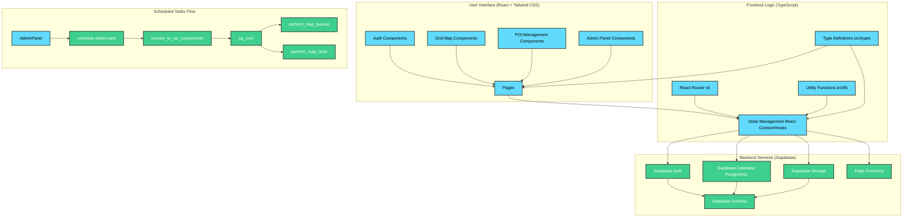
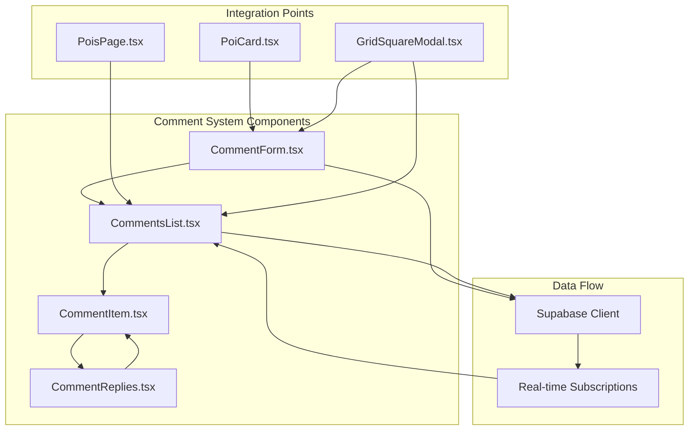
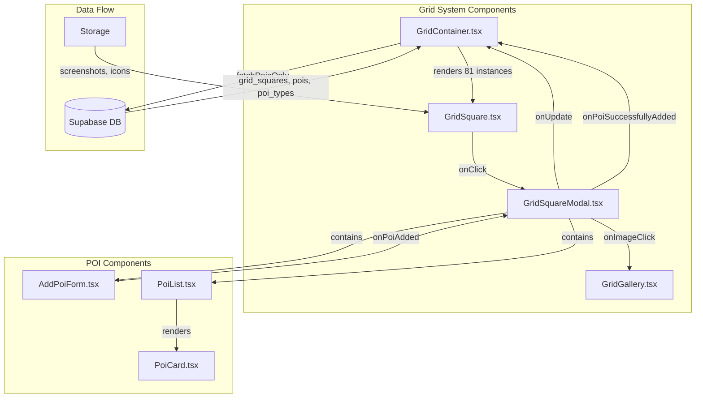
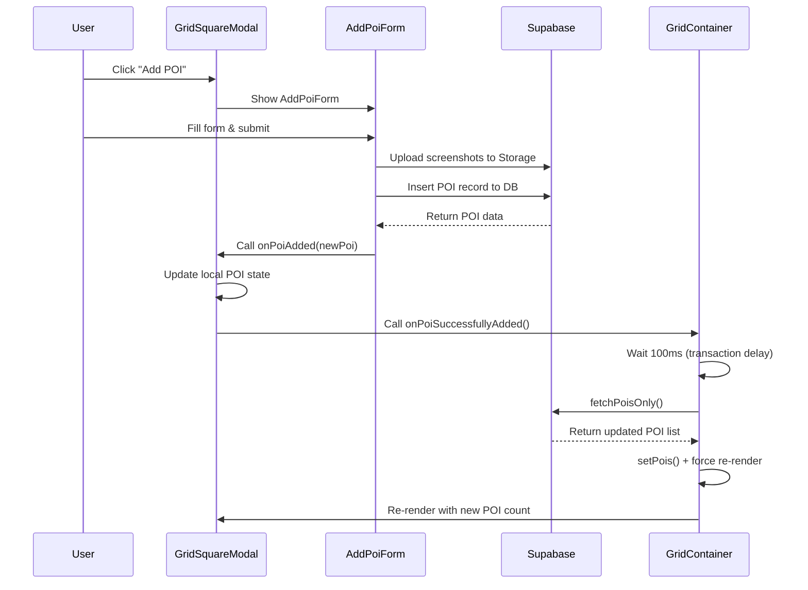
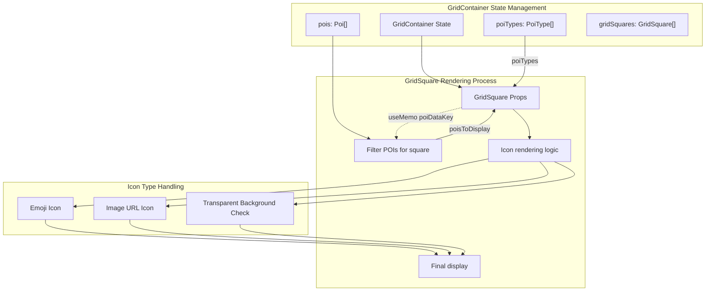
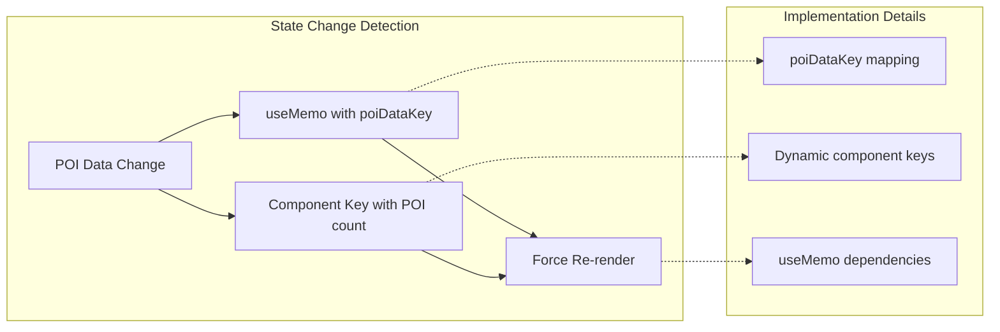
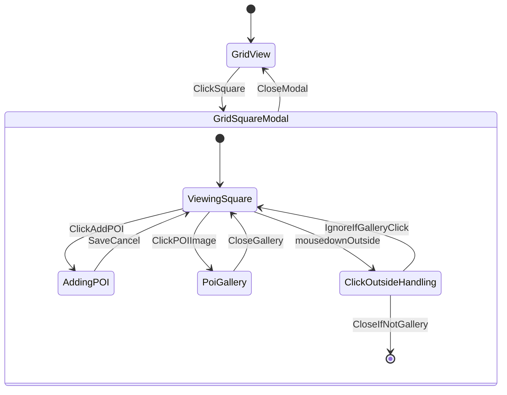
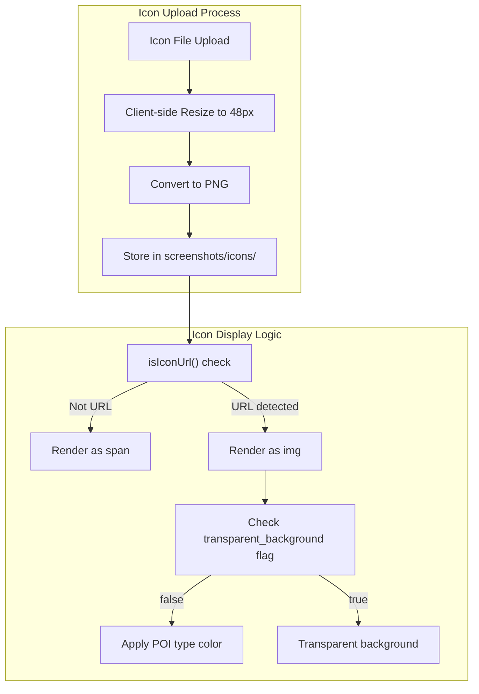
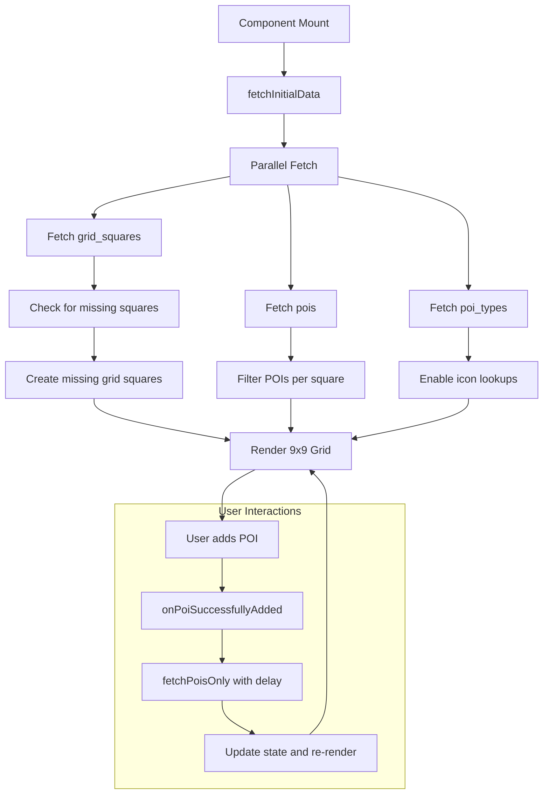

# System Architecture: Dune Awakening Deep Desert Tracker

## 1. Overview

The Dune Awakening Deep Desert Tracker is a web application built with React (TypeScript) on the frontend and Supabase for backend services (Authentication, Database, Storage). The application allows users to track exploration data on a grid-based map of Dune Awakening's deep desert region.

## 2. Components and Layers



### 2.1. Frontend (Client-Side)

-   **Presentation Layer (src/components, src/pages)**:
    -   Built with React 18 and TypeScript.
    -   Uses Tailwind CSS for styling.
    -   Lucide React for icons.
    -   Components are organized into: `admin`, `auth`, `common`, `grid`, `poi`.
    -   `pages/` directory contains top-level page components.
-   **Application Logic (src/lib, src/types, React Hooks/Context)**:
    -   React Router v6 for client-side routing.
    -   State management likely handled by React Context API and hooks.
    -   `src/lib/supabase.ts` configures the Supabase client.
    -   `src/types/index.ts` defines TypeScript interfaces for data structures.

### 2.2. Backend (Server-Side - Supabase)

-   **Supabase Auth**:
    -   Handles user authentication (signup, signin).
    -   Manages user roles and sessions.
-   **Supabase Database (PostgreSQL)**:
    -   Stores application data:
        -   `profiles`: User profiles and roles.
        -   `grid_squares`: Grid map data and screenshot metadata.
        -   `poi_types`: POI categories and types.
        -   `pois`: Point of Interest data.
    -   Row Level Security (RLS) policies are enforced on all tables.
    -   Database migrations are located in `/supabase/migrations/`.
-   **Supabase Storage**:
    -   `screenshots` bucket: Stores grid square screenshots (public read, authenticated upload, user-specific delete). Also stores POI type icons in an `icons/` subfolder (public read, admin/editor upload/delete).
    -   `poi-icons` bucket: Stores POI type icons (public read, admin/editor upload/delete).  *DEPRECATED in favor of `screenshots/icons/` due to access issues.*
-   **Supabase Edge Functions (located in `/supabase/functions/`)**:
    -   `manage-database`: Handles database operations (backup, restore, reset map data).
    -   `get-user-emails`: Admin-only function for retrieving user email addresses.

## 3. Data Flow

1.  **User Interaction**: User interacts with React components in their browser.
2.  **API Calls**: Frontend components make calls to Supabase services (Auth, Database, Storage, Edge Functions) via the Supabase client library.
3.  **Authentication**: Supabase Auth verifies user credentials and manages sessions. User roles determine access to features and data.
4.  **Data Operations**: CRUD (Create, Read, Update, Delete) operations on the Supabase Database are performed according to RLS policies.
5.  **File Storage**: Screenshots and icons are uploaded to/retrieved from Supabase Storage, respecting bucket policies.
6.  **Edge Functions**: Specific backend logic (e.g., database management) is executed via serverless Edge Functions.

## 4. Key Architectural Decisions

-   **Serverless Backend**: Leveraging Supabase for BaaS (Backend as a Service) reduces server management overhead.
-   **Component-Based UI**: React promotes modular and reusable UI components.
-   **TypeScript**: Static typing for improved code quality and maintainability.
-   **Tailwind CSS**: Utility-first CSS for rapid UI development and consistent styling.
-   **Role-Based Access Control (RBAC)**: Enforced at multiple levels (frontend UI, Supabase RLS) for security.

## 5. Directory Structure (Key Areas)

-   `src/`: Contains all frontend source code.
    -   `components/`: Reusable React components, categorized by feature.
    -   `lib/`: Utility functions, Supabase client configuration.
    -   `pages/`: Top-level page components for routing.
    -   `types/`: TypeScript type definitions.
-   `supabase/`: Contains backend configurations for Supabase.
    -   `functions/`: Edge Function code.
    -   `migrations/`: Database schema migrations.

## 6. Current Workflow (High-Level - Example: Adding a POI)

1.  User logs in (Supabase Auth).
2.  User navigates to a grid square on the map (React Router, Grid components).
3.  User clicks "Add POI" (POI components).
4.  Frontend form captures POI details (title, type, description, screenshots).
5.  On submission, frontend calls Supabase client to:
    a.  Upload POI screenshots to Supabase Storage (`screenshots` bucket).
    b.  Insert new POI record into `pois` table in Supabase Database (respecting RLS).
6.  UI updates to reflect the newly added POI. 

## 7. POI Type Management Specifics

-   **Icon Storage**: POI Type icons (emojis or uploaded images) are managed via `PoiTypeManager.tsx`.
    -   Uploaded icons are resized client-side (max 48px) and converted to PNG.
    -   Icons are stored in the `screenshots` Supabase Storage bucket, under an `icons/` subfolder.
-   **Transparent Backgrounds**: POI Types have an `icon_has_transparent_background` boolean flag.
    -   If true, and the icon is an image URL, the POI type's `color` property is not used as a background for the icon in displays like `PoiCard.tsx` and `GridSquare.tsx`.

### 7.1. POI Display and Interaction (PoisPage, GridSquareModal, GridGallery)

- **Data Flow for POI Details**: `PoisPage` fetches all POIs and their associated `grid_square` data, creating `PoiWithGridSquare` objects. 
  - Clicking a `PoiCard` or `PoiListItem` on `PoisPage` sets `selectedPoi` and `selectedGridSquare`, opening `GridSquareModal`.
  - `GridSquareModal` displays details of the `selectedGridSquare` and lists its associated POIs (fetched internally by the modal based on `currentSquare.id`).

- **POI-Specific Gallery Opening**: 
  - A consistent `handleGalleryOpen(poi)` function in `PoisPage` is used to manage the state for displaying `GridGallery` with a specific POI's screenshots.
  - This function is passed as `onImageClick` to `PoiCard` and `PoiListItem` on `PoisPage` for direct gallery access.
  - It's also passed as `onPoiGalleryOpen` to `GridSquareModal`.
  - `GridSquareModal` then passes this `onPoiGalleryOpen` to its internal `PoiList`.
  - `PoiList` uses `onPoiGalleryOpen` for the `onImageClick` event of `PoiCard`s it renders, allowing gallery opening from the list within the modal.
  - The main image of `GridSquareModal` (when the modal is opened from `PoisPage`) also uses an `onImageClick` prop (wired in `PoisPage`) to trigger `handleGalleryOpen` for the initially selected POI.

- **Modal Stacking and Closure (GridSquareModal & GridGallery)**:
  - `GridSquareModal` has a "click outside" listener (`handleClickOutside`) attached to `document` (`mousedown`) to close itself.
  - `GridGallery` is an overlay. To prevent clicks on `GridGallery` (backdrop or its own close button) from also closing `GridSquareModal`, the following measures are in place:
    - `GridGallery`'s backdrop and "X" button click handlers call `event.stopPropagation()`.
    - `GridSquareModal`'s `handleClickOutside` function includes a specific check: if the `event.target` of the `mousedown` is part of the `GridGallery` structure (identified by CSS classes `div[class*="bg-night-950/90"][class*="z-[60"]`), it ignores the event and does not close itself. This ensures `GridGallery` can be closed without affecting the underlying `GridSquareModal`. 

### 7.2. Scheduled Tasks Timezone Handling

To allow administrators to schedule tasks (like backups and resets) in their local time, the following process is used:

1.  **Frontend (`AdminPanel.tsx`)**: Collects the desired local time, date, and frequency. It also detects the user's browser IANA timezone identifier (e.g., "Europe/Berlin"). These details are sent to the `schedule-admin-task` Supabase Function.
2.  **Supabase Function (`schedule-admin-task`)**: 
    *   Receives the local time, date, frequency, and the user's timezone.
    *   It calls the PostgreSQL helper function `convert_to_utc_components` via RPC, passing the local date/time string (e.g., "YYYY-MM-DD HH:MM:SS") and the IANA timezone.
3.  **PostgreSQL Function (`convert_to_utc_components`)**: 
    *   Takes the local timestamp string and the IANA timezone identifier.
    *   Uses PostgreSQL's internal timezone conversion capabilities (`AT TIME ZONE`) to convert the local timestamp to its equivalent UTC. 
    *   Extracts and returns the UTC hour, UTC minute, and UTC day of the week (0 for Sunday, compatible with `pg_cron`).
4.  **Supabase Function (`schedule-admin-task`)**: 
    *   Receives the UTC components from the SQL function.
    *   Constructs a UTC-based CRON expression.
    *   Schedules the job with `pg_cron` using another RPC call to `schedule_cron_job`.
5.  **Display**: When fetching and displaying scheduled tasks, the UTC time components derived from the cron job are converted back to the user's local time in the `AdminPanel.tsx` for a consistent user experience.

This approach ensures that `pg_cron` (which operates on UTC) correctly schedules tasks according to the user's local time intention, handling complexities like Daylight Saving Time (DST) via PostgreSQL's robust timezone engine.

### 7.3. Data Storage and Management

-   **Grid Square Data**: `grid_squares` table stores grid map data and screenshot metadata
-   **POI Data**: `pois` table stores point of interest data with relationships to grid squares and types
-   **POI Types**: `poi_types` table defines categories, icons, colors, and default descriptions
-   **User Profiles**: `profiles` table stores user profiles and roles linked to Supabase Auth
-   **Screenshot Storage**: `screenshots` bucket stores grid square screenshots and POI type icons
-   **Scheduled Tasks**: `pg_cron` schedules and executes automated tasks like backups and resets
-   **Edge Functions**: Handle privileged operations like database management and user administration

This architecture ensures efficient data storage, secure access, and reliable task execution, providing a robust backend foundation for the Dune Awakening Deep Desert Tracker.

## 8. Detailed Code Flow Documentation

## 8. Recent Technical Implementations

### 8.1. Filter System Alignment & UI Consistency (2025-01-01)

**Achievement**: Successfully unified the filtering systems between POI page and grid map for consistent user experience.

**Key Changes Implemented:**

1. **Grid Map Filter Styling Updates (`src/components/filters/GridFilter.tsx`)**:
   - Migrated from custom styling (`px-3 py-1 text-xs rounded-full` with custom colors) to standardized `btn` classes
   - Category buttons now use `btn text-xs px-2 py-1` with `btn-primary`/`btn-outline` states
   - POI type buttons follow same styling pattern for consistency
   - Clear filters button updated to `btn btn-danger text-xs w-full md:w-auto`

2. **POI Page Filter Structure Updates (`src/pages/PoisPage.tsx`)**:
   - Implemented consistent category grouping structure matching grid map approach
   - Simplified complex conditional logic for type grouping
   - Added proper uncategorized section handling
   - Removed unused `availablePoiTypesForTagging` computed value

3. **Visual Consistency Improvements**:
   - **Background Alignment**: Added `bg-sand-50` background to grid map filter section to match POI page
   - **Color Harmony**: Updated POI filter titles from `text-night-800` to `text-sand-800` for consistency
   - **Subtitle Alignment**: Changed category subtitles from `text-night-700` to `text-sand-600`
   - **Unified Theme**: Both filters now use identical color schemes and visual hierarchy

**Impact**: Users now experience consistent filtering patterns across all interfaces, reducing cognitive load and improving navigation efficiency.

**Files Modified**:
- `src/components/filters/GridFilter.tsx` (styling and structure)
- `src/pages/PoisPage.tsx` (filter logic and structure)

### 8.2. Comment System Architecture (Planned)

**Database Schema Design**:
```sql
-- POI Comments Table
CREATE TABLE poi_comments (
    id UUID PRIMARY KEY DEFAULT gen_random_uuid(),
    poi_id UUID REFERENCES pois(id) ON DELETE CASCADE,
    user_id UUID REFERENCES profiles(id) ON DELETE CASCADE,
    content TEXT NOT NULL,
    parent_id UUID REFERENCES poi_comments(id) ON DELETE CASCADE, -- For threading
    created_at TIMESTAMP WITH TIME ZONE DEFAULT NOW(),
    updated_at TIMESTAMP WITH TIME ZONE DEFAULT NOW()
);

-- Grid Square Comments Table  
CREATE TABLE grid_comments (
    id UUID PRIMARY KEY DEFAULT gen_random_uuid(),
    grid_square_id UUID REFERENCES grid_squares(id) ON DELETE CASCADE,
    user_id UUID REFERENCES profiles(id) ON DELETE CASCADE,
    content TEXT NOT NULL,
    parent_id UUID REFERENCES grid_comments(id) ON DELETE CASCADE, -- For threading
    created_at TIMESTAMP WITH TIME ZONE DEFAULT NOW(),
    updated_at TIMESTAMP WITH TIME ZONE DEFAULT NOW()
);
```

**Component Architecture**:


**Features Planned**:
- Threaded comment discussions with reply support
- Real-time comment updates via Supabase subscriptions
- Moderation tools for admins
- Comment filtering and sorting options
- User mention system (@username)
- Comment reactions/voting system

### 8.3. Grid Map System - Component Flow

The grid map system consists of several interconnected components that manage the 9x9 grid display, POI visualization, and user interactions.



### 8.2. POI Creation Flow - Detailed Steps



### 8.3. Grid Square Rendering & POI Icon Display



### 8.4. React State Synchronization Pattern

The application uses a specific pattern to ensure React components re-render when underlying data changes:



**Implementation Details:**

- **poiDataKey mapping**: `poiDataKey = pois.map(poi => \`${poi.id}-${poi.poi_type_id}\`).join(',')`
- **Dynamic component keys**: `key={\`square-${coordinate}-${poisForThisSquare.length}\`}`
- **useMemo dependencies**: `useMemo(() => {...}, [poiDataKey])`

### 8.5. Modal State Management & Gallery Interaction



### 8.6. Icon Type Management Flow



### 8.7. Data Flow: Grid Container Lifecycle



### 8.8. Component Communication Patterns

#### Callback Chain for POI Updates

```
AddPoiForm.onSubmit()
  ↓ (onPoiAdded)
GridSquareModal.handleAddPoi()
  ↓ (onPoiSuccessfullyAdded)
GridContainer.fetchPoisOnly()
  ↓ (setPois + re-render trigger)
GridSquare components re-render with new POI icons
```

#### Data Flow for Icon Display

```
GridContainer.pois[] 
  ↓ (filter by grid_square_id)
GridSquare.poisToDisplay[]
  ↓ (map to unique poi_type_ids)
PoiType.icon + PoiType.color + PoiType.icon_has_transparent_background
  ↓ (render logic)
Icon display with proper styling and background
```

### 8.9. Performance Optimizations

1. **React.useMemo for POI Data**: Creates dependencies on actual data changes rather than object references
2. **Component Keys**: Include dynamic data (POI count) to help React's reconciliation  
3. **Debounced Updates**: 100ms delay prevents excessive re-fetching during rapid updates
4. **Filtered Data Passing**: Only pass relevant POIs to each GridSquare component
5. **Image Resizing**: Client-side icon resizing reduces storage and bandwidth requirements

### 8.10. Error Handling & Debugging

The application includes comprehensive debugging for troubleshooting:

- **Console Logging**: Strategic logs throughout the POI creation and update flow
- **Error Boundaries**: Graceful error handling in UI components  
- **State Validation**: Checks for data consistency and callback availability
- **Network Error Handling**: Proper error messages for Supabase operations
- **User Feedback**: Loading states and error messages for all async operations

This detailed flow documentation provides a comprehensive understanding of how the major features interact, making it easier for developers to understand the codebase, debug issues, and implement new features. 